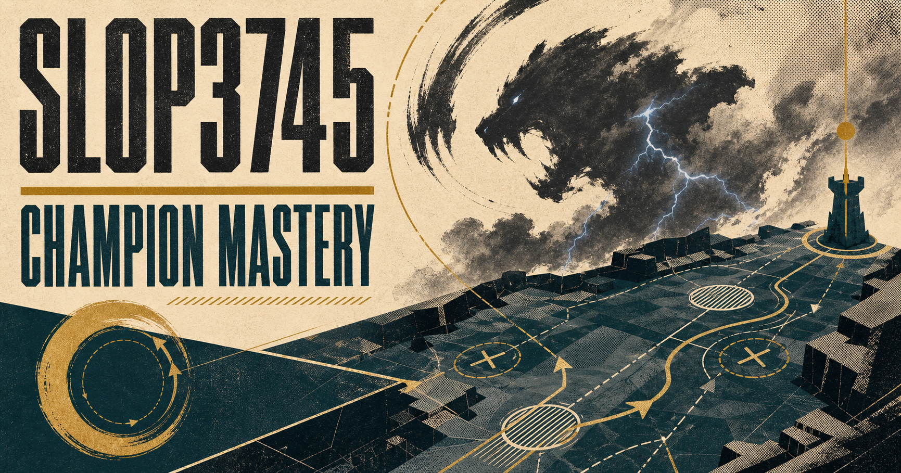
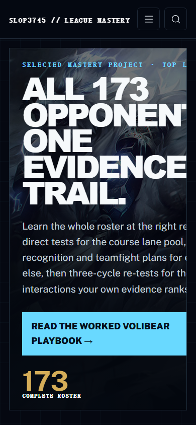
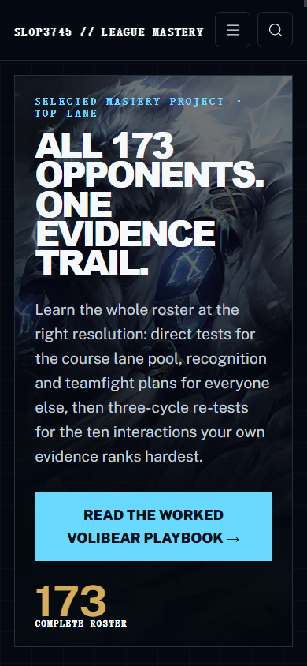

# Process overview

## Position and response

SLOP3745 is the League of Legends course I wanted but could not find: twelve weeks devoted to mastering one champion deeply enough that “counter” stops being a tier-list verdict and becomes a testable claim. Students choose one champion and role; Volibear top is the worked example. One loop—plan, drill, test, review, revise—moves from mechanics to lane matchups and finally whole-map decisions.

The first direction was a general MOBA performance course. It produced plausible weekly topics but no promise precise enough to reject weak content. I narrowed it to a coverage problem: common lane opponents deserve controlled one-versus-one tests, every champion deserves an interaction plan, and evidence promotes uncertain or important cases into direct testing. That decision avoids the obvious but empty alternative of 173 identical drills. The resulting twelve lectures, twelve Champion Labs, 20/40/40 assessment sequence, full-roster atlas, and worked playbook first appear together in [`5a6bd29`](https://github.com/comp4020-agentic-coding-studio/comp4020-ass2-2513238602/commit/5a6bd29).

## What the harness protects

I encoded promises that a build could otherwise satisfy while the course quietly drifted: every week must contain a lecture and lab; assessment must total 100%; all five loop stages must appear; the roster must contain 173 unique entries; the ten priority interactions must remain visible; and every champion must have a persistent status control. `CLAUDE.md` also rejects unsupported “mastered” claims, requires a re-test trigger, and preserves base-aware links, accessible controls, and a no-storage baseline.

I deliberately left two decisions outside automated checks: whether the curriculum has a compelling voice, and whether an exercise teaches a meaningful transfer rather than merely containing the right headings. Turning those into keyword tests would reward content-shaped filler. I reviewed non-adjacent weeks and the student journey instead. That distinction mattered when a structurally complete first build still looked like a generic university system; [`7d31e7e`](https://github.com/comp4020-agentic-coding-studio/comp4020-ass2-2513238602/commit/7d31e7e) rebuilt it around a competitive-training identity rather than treating restyling as polish.

The less visible harness work was equally deliberate. A Windows module-loading failure survived reinstalling dependencies, so I isolated the loader mismatch instead of replacing the provided course integrations. The resulting fix and the first accessibility and hierarchy audit are recorded in [`5202188`](https://github.com/comp4020-agentic-coding-studio/comp4020-ass2-2513238602/commit/5202188).

## How I accepted the result

An initial visual review claimed the two marking viewports were sound, but an exact 390×844 browser audit later found the Atlas hero clipping its own text. That was a useful failure: document-level overflow checks had stayed green because the clipping happened inside an `overflow: hidden` component. I constrained the hero’s min-content width and type scale, then added a browser contract covering the marker’s sampled pages at both 1920×1080 and 390×844. It also tabs into the page and changes Atlas state before resizing, so responsive behaviour is checked mid-interaction rather than only at load.

| 390×844 before | 390×844 after |
| --- | --- |
|  |  |

The same audit exposed a contradiction: the harness prohibited runtime image dependencies while the design hotlinked Data Dragon. In [`01799db`](https://github.com/comp4020-agentic-coding-studio/comp4020-ass2-2513238602/commit/01799db), I cached and compressed 194 version-recorded assets, added tests for complete local coverage and zero rendered Data Dragon requests, and made clean installation and secret scanning work on both Windows and Linux. I accepted the revision only after `pnpm check` built 40 pages with no accessibility or broken-link findings, passed ten course tests, and passed all sixteen page/viewport combinations plus the resize and keyboard checks. The final site is deliberately not a build guide: it is a system for proving, revising, and maintaining what a player thinks they know.
